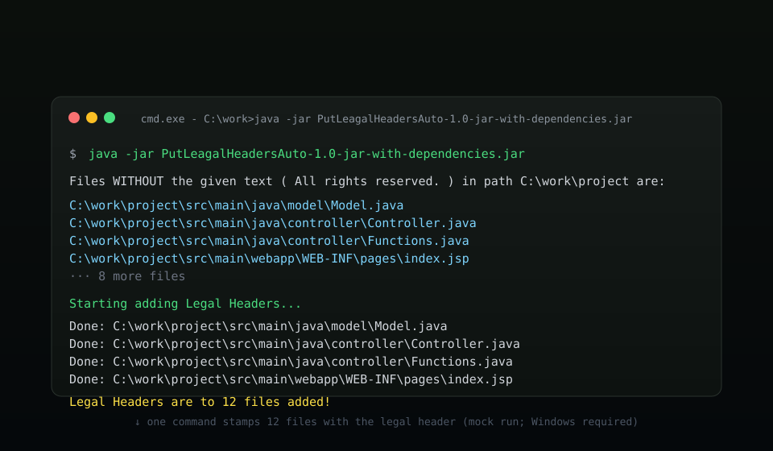

[](https://github.com/hmmaros/put-legal-headers/actions/workflows/build.yml)


> **LEGACY · 2018** — Java 8 · Maven · json-simple · Windows
>
> One of my early tools, kept on GitHub for posterity. It isn't pretty, it
> isn't cross-platform, but it *was* the fastest way to make the license
> auditor smile.

---

## The Story

Back in 2018, every source file had to ship with a copyright header. The
reviewer had a ruler; everyone had finger-memory of the header text — and
nobody had the *time* to type it into a hundred files after a refactor.

I wrote `PutLegalHeaders` as the answer: a dead-simple CLI that scans `.java`
files (any suffix, really), finds the ones missing the magic line — *"All
rights reserved."* — and stamps the header on top. Run once, done. The idea
later (much later) grew a face in the sibling repo `put-legal-headers-with-ui`.

`cmd.exe` did the heavy lifting; `json-simple` read `.json`; and a `tempFile.txt`
shuffle kept the original content safe. It worked — almost always.

---

## At a glance

| The good | The honest truth |
| --- | --- |
| Scans folders recursively for files *missing* a marker text | Discovery shells out to Windows `cmd.exe` (`for /r` + `find`) |
| Prepends any legal header, UTF-8-safe | Writes via a `tempFile.txt` buffer — clear, write, restore |
| Auto comment-wraps per file type | Only `/* */` (code) and `<!-- -->` (HTML) |
| Behavior fully driven by `config.json` | `WITHOUT` vs `WITH` mode is a one-line flag |
| One dependency (`json-simple`) | Maven `assembly` plugin builds a fat runnable JAR |



---

## Quick start

```bash
mvn clean package
```

Edit `config.json`:

```json
{
  "directoryPath": "C:\\path\\to\\your\\source",
  "textToFind": "All rights reserved.",
  "suffix": "*.java",
  "withOrWithoutText": "WITHOUT"
}
```

Drop the header you want prepended into `inputText.txt`, then:

```bash
java -jar target/PutLeagalHeadersAuto-1.0-jar-with-dependencies.jar
```

> `WITHOUT` finds files **lacking** the text (the case you run to add
> headers). `WITH` finds files **containing** it — great for audits.

---

## Retrospective: what I'd build differently today

- **No more `cmd.exe`.** A `java.nio.file.Files.walk` scan is portable,
  sandboxed, and literally a day of my youth, given back.
- **No more temp-file shuffle.** Write in memory: read → prepend → write.
- **A `--dry-run` flag.** Preview the matched list before touching anything.
- **Jackson instead of `json-simple`** (or simply a few CLI args).
- **Tests.** There were exactly zero. There should have been several.

That the tool exists at all is the point: recognizing that a mind-numbing,
hand-typed, do-not-forget chore is *exactly* what code is for.

---

## Archived roadmap

- [x] Recursive scan, text-aware matching, header insertion (2018)
- [x] `config.json`, UTF-8 I/O, comment wrapping (2018)
- [ ] Cross-platform discovery (`Files.walk`) — abandoned with the project
- [ ] Dry-run mode, unit tests, per-suffix comment config — never applied

*Status: kept as a legacy artefact; no active development.*

---

## Reference

- [Configuration](#configuration)
- [Comment wrapping](#comment-wrapping)
- [Project structure](#project-structure)
- [Logging](#logging)
- [Limitations](#limitations)
- [Contributing](#contributing)

### Configuration

All parameters live in `config.json` next to the JAR:

| Key | Example | Meaning |
| --- | --- | --- |
| `directoryPath` | `C:\Users\me\src` | Folder tree to scan recursively |
| `textToFind` | `All rights reserved.` | Marker text tested against each file |
| `suffix` | `*.java` | File pattern(s) to match |
| `withOrWithoutText` | `WITHOUT` | Select files *without* (`WITHOUT`) or *with* (`WITH`) the text |

The header text lives in `inputText.txt` (auto-created if missing; the app
aborts if it is empty). Files are scanned with a Windows `cmd` loop:

```
@for /r %f in (*.java) do @find /i "All rights reserved." "%f" > nul || echo %f
```

### Comment wrapping

| File ends with | Wrapping |
| --- | --- |
| `.html` | `<!--` … `-->` |
| everything else (e.g. `.java`) | `/*` … `*/` |

### Project structure

```
put-legal-headers/
├── assets/                  # README artwork (header + mockup)
├── src/main/java/
│   ├── main/Main.java       # Entry point
│   ├── controller/
│   │   ├── Controller.java  # Startup orchestration + config parsing
│   │   └── Functions.java   # File discovery + header insertion
│   ├── model/Model.java     # Shared state (config + header text)
│   ├── finals/Finals.java   # Constants (input/temp names, comment markers)
│   └── logger/MyLogger.java # Logging
├── config.json              # Tool configuration
├── inputText.txt            # Legal header text
└── pom.xml                  # Maven build (assembly → fat JAR)
```

> `tempFile.txt` is a runtime scratch file (git-ignored). Developer rules live
> in [AGENTS.md](AGENTS.md).

### Logging

`java.util.logging` writes to `%T/ReWarMe.log` — the filename is inherited from
its dev-tool sibling `re-war-me`, making this a happy little family.

### Limitations

- **Windows-only** — file discovery requires `cmd.exe`.
- **No dry-run** — once started, it rewrites files. Test on a copy first.
- **Write flow** — content goes through `tempFile.txt`; don't run two instances
  against the same folder.
- **Comment styles** — HTML vs everything-else; no `.adoc`/shell variants here
  (that feature landed in the GUI sibling).

### Contributing

1. Fork and branch (`git checkout -b feature/your-feature`).
2. Follow [AGENTS.md](AGENTS.md): no new dependencies, constants in `Finals`,
   keep the CLI style — the UI lives in `put-legal-headers-with-ui`.
3. Commit clearly, push, open a pull request.

---

## Part of the 2018 Toolbox

Three small experiments from the same era, kept for posterity:

| Repo | What it did |
| --- | --- |
| [**ReWarMe**](https://github.com/hmmaros/re-war-me) | WAR redeploy on autopilot |
| **PutLegalHeaders** | License-scanning CLI |
| [**PutLegalHeaders (GUI)**](https://github.com/hmmaros/put-legal-headers-with-ui) | The same idea, with a face |
| [**BlueLogs**](https://github.com/hmmaros/blue-logs) | All your logs, one screen |

---

## Disclaimer

This tool **deletes and rewrites file contents** to insert headers. Only point
it at files you intend to modify, and test on a copy first. I'm not responsible
for data loss caused by running it.

---

## License

Released under the [MIT License](LICENSE) © 2018 hmmaros.